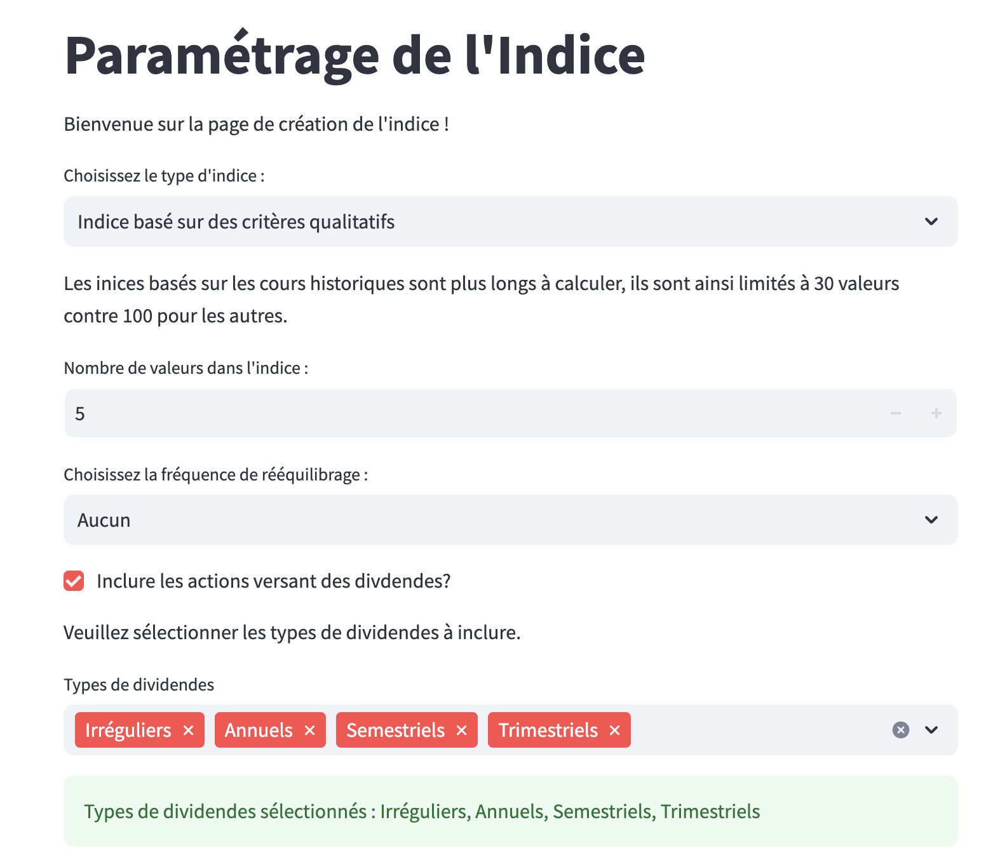
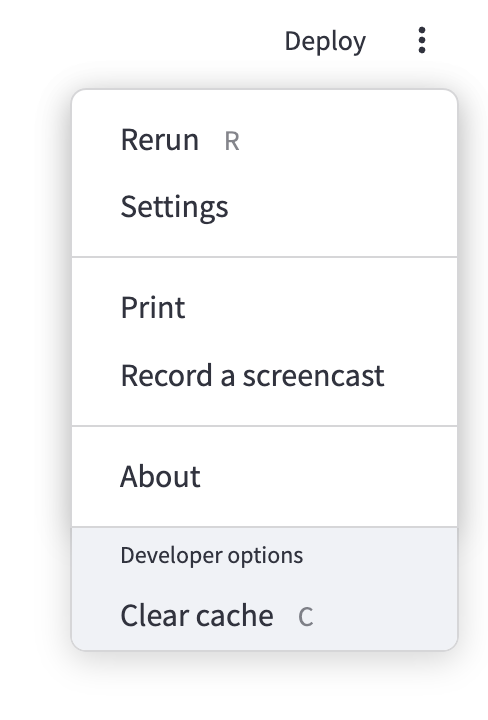

# Financial Index Tracker

## Description

**Financial Index Tracker** est une application interactive développée avec **Streamlit** permettant de :  
- Configurer et créer des indices financiers à partir d'un univers de valeurs définies par l'utilisateur.  
- Personnaliser les critères de sélection (secteurs, pays, styles d'investissement, dividendes, etc.).  
- Analyser la composition, la performance et le risque des indices créés.  
- Visualiser les résultats sous forme de graphiques interactifs et partager ces visualisations via les fonctionnalités d'exportation de Streamlit.

Le projet, bien qu'initialement conçu pour répondre à des consignes spécifiques, a été enrichi d'une interface utilisateur complète et flexible, permettant de s'adapter à divers besoins. Malgré certaines limitations dues au temps et à la complexité, l'architecture du code utilise une approche orientée objet (POO) pour offrir une base extensible et maintenable pour des projets futurs.

---

## Fonctionnalités principales

1. **Configuration de l'indice :**
   - Définir un univers d'actions selon des critères de pays, secteurs (BICS1-4), ou indices existants.
   ### 1. Page d'accueil
   
   
   - Personnaliser la taille de l'indice (recommandé : moins de 15 pour limiter le temps de chargement).
   
   - Spécifier des contraintes sur les valeurs (dividendes, caractéristiques qualitatives, etc.).
   - Sélectionner le type d'indice :
     - `Market Cap Index`
     - `Growth Index (PB)`
     - `Growth Index (PE)`
     - `Value Index (PB)`
     - `Value Index (PE)`
     - `Dividend Yield Index`
   
   - Activer ou désactiver les rebalancements annuels.
   - Définir la devise de l'indice et le type de pondération (équipondéré ou pondéré).
   

3. **Création de l'indice :**
   - Analyse préalable de la configuration pour vérifier la cohérence et la disponibilité des données.
   - Calcul dynamique des indices à partir des prix historiques et des données qualitatives fournies.


4. **Visualisation et analyse :**
   - Graphiques interactifs :
     - Répartition sectorielle, par pays ou par style.
     
     
     - Comparaison de l'indice avec des benchmarks.
     - Évolution des indices au fil du temps.
     
   - Analyse des valeurs entrantes et sortantes lors des rebalancements.
     
   - Exportation facile des résultats via Streamlit (impression ou sauvegarde).
   
---

## Structure du projet


## Installation et utilisation
```bash

### 1. Cloner le projet

git clone https://github.com/guilhembarroyer/financial-index-tracker.git
cd financial-index-tracker

### 2. Configurer l'environnement Python

poetry install
#ou
python -m venv venv
source venv/bin/activate  # macOS/Linux
venv\Scripts\activate     # Windows
pip install -r requirements.txt

### 3. Lancer l'application Streamlit
streamlit run Source/interface_utilisateur.py (ex: streamlit run /Users/guilhembarroyer/Desktop/Projects/financial-index-tracker/Source/interface_utilisateur.py)

```bash
